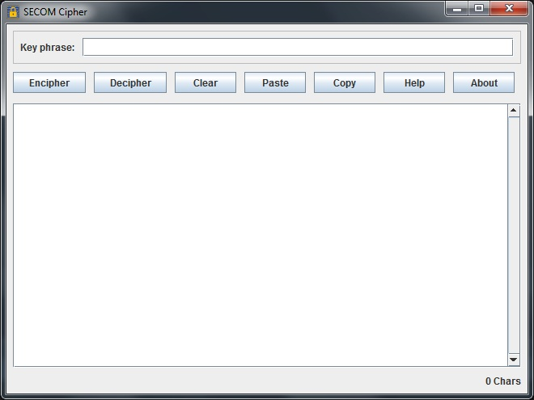
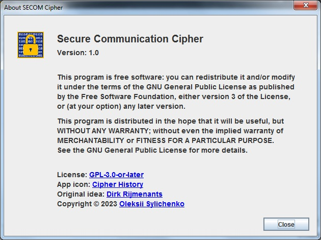

# The SECOM cipher GUI application

This is simple encipher/decipher GUI application that allows you to work with the SECOM cipher.

It was implemented according to the original <a href="https://www.ciphermachinesandcryptology.com/en/secom.htm">Dirk Rijmenants's</a> description.

Below you can find [my modified version](#the-secom-cipher) of this description.

The application contains this description as well - just click "Help" button.

## Main window

## About

## System requirenments

- Java 19

## How to run

You have two options:
- run GUI application: 
- run Demo example console application: 

## For developers

This software was created with JetBrains IntelliJ IDEA, GUI Forms as well.

Despite that fact, you can open it with any other IDE.

My IntelliJ IDEA was configured to autogenerate GUI code and special runner was added into Maven's dependencies.

This option you can find in the settings of your IntelliJ IDEA:

## License

This software is licensed under GNU LESSER GENERAL PUBLIC LICENSE Version 3 or later.

https://www.gnu.org/licenses/lgpl-3.0.en.html

## The SECOM cipher

    The SECOM cipher is a hand cipher to encrypt a message, containing letters, numbers and spaces.

    The enciphering process consists of 3 phases:

<ol>
    <li>converting plain text into digits by the Straddling Checkerboard;</li>
    <li>simple Columnar Transposition;</li>
    <li>disrupted Columnar Transposition.</li>
</ol>

### EXAMPLE

Plain text:

<pre>RV TOMORROW AT 1400PM TO COMPLETE TRANSACTION USE DEADDROP AS USUAL</pre>

Key Phrase:

<pre>MAKE NEW FRIENDS BUT KEEP THE OLD</pre>

### INITIAL PHASE: KEY PHRASE PROCESSING

    Take the first 20 letters of the key phrase (letters only, skip spaces) and split them into two halves.
    Within each half, number each letter in alphabetical order: starting from 1 and ending with 0 which represents
    the 10th letter in alphabetical order. The same letters should be numbered consecutively.

<pre>
MAKENEWFRI ENDSBUTKEE
7162830495 3728109645
</pre>

Sum them up digit by digit, ignoring carries.

<pre>
 7162830495 - MAKENEWFRI
+3728109645 - ENDSBUTKEE
 ----------
 0880939030
</pre>

    Then generate a pseudo-random 50-digit sequence from the result using the
    <a href="https://en.wikipedia.org/wiki/Lagged_Fibonacci_generator">Lagged&nbsp;Fibonacci&nbsp;generator</a>:

<ol>
    <li>set the sequence to the given seed;</li>
    <li>sum up first two digits of the sequence, discard the carry;</li>
    <li>put the sum at the end of the sequence;</li>
    <li>repeat the process with the next pair of digits until 50 digits is generated.</li>
</ol>

<pre>
0880939030 -> 8689229338&hellip;
0+8=8
8+8=(1)6
8+0=8
0+9=9
9+3=(1)2
3+9=(1)2
9+0=9
0+3=3
3+0=3
0+8=8
&hellip;
</pre>

Resulting LFG-sequence:

<pre>
0880939030 - the seed
---------- - generated digits
8689229338
4471412612
8185538730
9930815039
8238965327
</pre>

### PHASE 1: THE STRADDLING CHECKERBOARD

    Take the last 10 digits of the LFG-sequence and number them
    as we do with letters in the beginning,
    1 for the smallest digit and 0 (representing 10) for the largest.
    This numbering will be the Checkerboard key.

<pre>
8238965327 - the last 10 digits of the LGF
8139065427 - the order of the digits
</pre>

    The default Checkerboard looks like this, where &laquo;*&raquo; - represents the space character:

<pre>
1 2 3 4 5 6 7 8 9 10 - index numbers
--------------------
E S - T O - N I - A
B C D F G H J K L M
P Q R U V W X Y Z *
1 2 3 4 5 6 7 8 9 0
</pre>

    The first row of the checkerboard contains the highest frequency letters ESTONIA,
    with a blank in the 3rd, 6th and 9th positions.

    Write down index numbers, the Checkerboard key and the first row of the default Checkerboard:

<pre>
| 1 2 3 4 5 6 7 8 9 10 - index numbers
| 8 1 3 9 0 6 5 4 2 7  - the key
+---------------------
| E S - T O - N I - A
</pre>

    Shift the second row so that the letter B (the first letter of the row)
    is under the index 3 - the digit of the key above the first blank:

<pre>
IDX | 1 2 <b>3</b> 4 5 6 7 8 9 10
KEY | 8 1 <b>3</b> 9 0 6 5 4 2 7
----+---------------------
 -  | E S <b>•</b> T O - N I - A
 3  | L M <b>B</b> C D F G H J K
</pre>

    Shift the third row so that the letter P is under the index 6
    - the digit of the key above the second blank:

<pre>
IDX | 1 2 3 4 5 <b>6</b> 7 8 9 10
KEY | 8 1 3 9 0 <b>6</b> 5 4 2 7
----+---------------------
 -  | E S - T O <b>•</b> N I - A
 3  | L M B C D F G H J K
 6  | W X Y Z * <b>P</b> Q R U V
</pre>

    Shift the fourth row so that the number 1 is under the index 2
    - the digit of the key above the third blank:

<pre>
IDX | 1 <b>2</b> 3 4 5 6 7 8 9 10
KEY | 8 1 3 9 0 6 5 4 <b>2</b> 7
----+---------------------
 -  | E S - T O - N I <b>•</b> A
 3  | L M b C D F G H J K
 6  | W X Y Z * p Q R U V
 2  | 0 <b>1</b> 2 3 4 5 6 7 8 9
</pre>

#### The Straddling Checkerboard encoding

    Replace each character of the plain text with numbers from the Checkerboard using the key:

<pre>
R  V  *  T O M  O R  R  O W  *  A T *
64 67 60 9 0 31 0 64 64 0 68 60 7 9 60

1  4  0  0  P  M  *  T O *  C  O M  P
21 20 28 28 66 31 60 9 0 60 39 0 31 66

L  E T E *  T R  A N S A C  T I O N *
38 8 9 8 60 9 64 7 5 1 7 39 9 4 0 5 60

U  S E *  D  E A D  D  R  O P  *  A S
62 1 8 60 30 8 7 30 30 64 0 66 60 7 1

*  U  S U  A L
60 62 1 62 7 38
</pre>

    <b>Note:</b> since the final result will be divided into groups of 5,
    at this stage the sequence must be filled with trailing zeros to complete the last group of 5.

Result:

<pre>646760903106464068607960212028286631609060390316638898609647517399405606218603087303064066607160621627380</pre>

### PHASE 2: COLUMNAR TRANSPOSITION

    To determine the number of columns for the two transpositions,
    take the unique digits one by one, starting from the end of the LFG&#8209;sequence,
    moving from left to right, add the digits until the result is greater than 9.
    The result is the width of the first columnar transposition. Continue the procedure
    to retrieve the width of the second columnar transposition:

<pre>
&hellip;8238965[327] -> 7+2=9; 9+3=12
&hellip;82389[65]327 -> 5+6=11
</pre>

    Key sizes for the columnar transpositions are 12 and 11 respectively.

#### Columnar transposition keys generation

    Take the 10 digits from the second half of the key phrase,
    and the 10 digits used for the straddling checkerboard
    and sum them up, digit by digit, ignoring carries:

<pre>
 3728109645 - the second half of the key phrase
+8139065427 - the Checkerboard key
 ----------
 1857164062
</pre>

Number the result digits (0 represents 10):

<pre>
1857164062 - the sum result
1958264073 - the order
</pre>

To get the keys for the columnar transpositions, use LFG&#8209;sequence:

<ol>
    <li>write down the order;</li>
    <li>write down the sequence row by row within 10 columns;</li>
    <li>
        read out digits by columns according to established order
        to get the first and then the second transposition keys.
    </li>
</ol>

<pre>
1958264073 - the order
---------- - the LFG-sequence
8689229338
4471412612
8185538730
9930815039
8238965327</pre>

The first key, 12 digits:

<pre>
1: 84898
2: 24589
3: 82---
--------
848982458982</pre>

The second key, 11 digits:

<pre>
3: --097
4: 92855
5: 878--
--------
09792855878</pre>

#### The first transposition

Simple columnar transposition:

<ol>
    <li>write down the key;</li>
    <li>number digits of the key as before;</li>
    <li>write down the numbers after the Straddling Checkerboard encoding row by row within the first key size;</li>
    <li>read out enciphered digits by columns in the order given by the key.</li>
</ol>

<pre>
848982458982 - the key
   1     11
637181459202 - the order
------------ - the message sequence
646760903106
464068607960
212028286631
609060390316
638898609647
517399405606
218603087303
064066607160
621627380---
</pre>

Result:

<pre>
088089367 60167630 461031162 962364063 008900808 642665206 642987841 662699062 376095770 06314006 700083606 19636631
</pre>

### PHASE 3: THE SECOND TRANSPOSITION

    The second transposition is a disrupted columnar transposition.
    The disruption means that you need to write down message digits
    row by row in the triangular areas which are defined by the order
    of the numbers in the key:

<ol>
    <li>start from the first row, the first column;</li>
    <li>write down digits one by one, until the position of the first number of the key;</li>
    <li>continue on the next row but write down one digit more than before;</li>
    <li>repeat the previous step until the entire row is filled;</li>
    <li>repeat the process for the second key number and so on until the rows run out;</li>
    <li>leave the last cells empty, if there are not enough digits to fill the full transposition block;</li>
    <li>then continue in the empty area starting from the first row, continue until the numbers run out.</li>
</ol>

    Since we know that the message is 105 digits long and the key is 11 digits long,
    it means that we have to fill 9 rows with 11 digits, and 1 row with 6 digits,
    the last 5 spaces must be left empty.

    First, fill the transposition block row by row with the numbers,
    avoiding the right triangular area that starts from position
    of the first number of the key:

<pre>
09792855878 - the key
1  1
19401623758 - the order
-----------
0880        - write down 4 digits, until 1
89367       - write down one digit more
601676      - 6
3046103     - 7
11629623    - 8
640630089   - 9
0080864266  - 10
52066429878 - 11, full row
416626      - write down 6 digits, until 2
990623----- - only 6 digits on the last row
</pre>

Now, just continue in the empty area from the first row:

<pre>
09792855878 - the key
1  1
19401623758 - the order
-----------
08807609577
89367006314
60167600670
30461030083
11629623606
64063008919
00808642666
52066429878
41662636631
990623-----
</pre>

Read out as usual for columnar transposition using the key:

<pre>
7771938622 000320423 960038296 8314608060 717801673 6060606463 536069686 740369681 8900140219 0666260666 0863160549
</pre>

    Finally, the digits are divided in groups of 5 to get the fully encrypted message:

<pre>
77719 38622 00032 04239 60038 29683 14608 06071 78016 73606 06064 63536 06968 67403 69681 89001 40219 06662 60666 08631 60549
</pre>

### MESSAGE DECRYPTION PROCESS

    Firstly use the key phrase to calculate the keys
    for the Checkerboard and the two transpositions
    by the same procedure as for enciphering.

Next apply transpositions in reversed order:

<ol>
    <li>the second (disrupted) transposition:
        <ol type="a">
            <li>create the block for the transposition with the appropriate key length;</li>
            <li>fill in the encrypted message column by column, according to the 2nd transposition key;</li>
            <li>read off the message row by row, avoiding the right triangular areas;</li>
            <li>read off the digits from the right triangular areas, also row by row.</li>
        </ol>
    </li>
    <li>the first (simple) transposition:
        <ol type="a">
            <li>
                fill in the block for transposition, created with the appropriate key length,
                column by column according to the 1st transposition key;
            </li>
            <li>
                read off the digits row by row.
            </li>
        </ol>
    </li>
</ol>

    Finally, convert the resulting sequence of digits to plain text, using the Checkerboard.

    Remember that the end of the sequence could contain up to four zero digits added to complete a block of five.

 
 

    <i>
        Original text was written by Dirk Rijmenants 
        <a href="https://www.ciphermachinesandcryptology.com/en/secom.htm">https://www.ciphermachinesandcryptology.com/en/secom.htm</a> 
    </i>

<i>Modified by: Oleksii Sylichenko, 2023</i>

